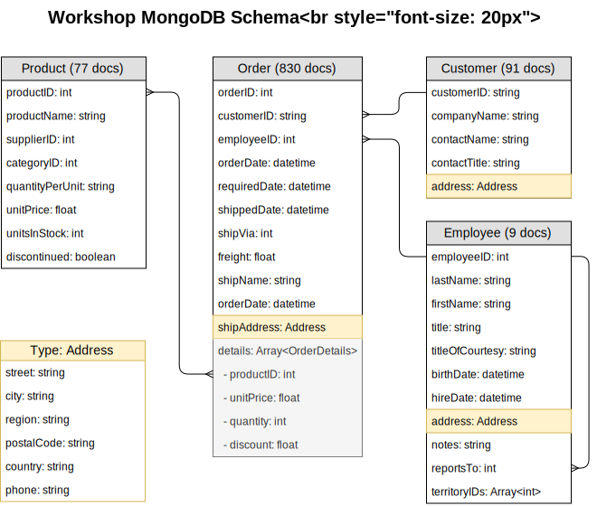

# Воркшоп по созданию GraphQL сервера на Node.JS и Apollo Client

- [План Old](./plan.md)
- [План 2](./plan2.md)

## Схема данных




[Полная модель данных Northwind](./misc/northwind)

## ФАК

1. Гит не видит нужных веток

```bash
git fetch origin
```

2. Как подсмотреть решение, не теряя прогресс?

```bash
# Текущая ветка git checkout step0-start
git stash # сохраните изменения
git checkout step0 # перейдите в ветку с решением
git checkout step0-start # вернитесь
git stash apply # загрузите сохранение
```

## Usage

### Clone the repository

```bash
git clone git@github.com:nodkz/graphql-workshop-ru.git
cd graphql-workshop-ru
```

### Install packages

```bash
yarn install
cd server && yarn install
cd client && yarn install
```

### Start the client and the server

```bash
yarn watch
```

Or only server

```bash
cd server && yarn watch
```

Or only client

```bash
cd client && yarn watch
```

### APP Diagramm

See [Northwind models](https://github.com/graphql-compose/graphql-compose-examples/tree/master/examples/northwind/data)
